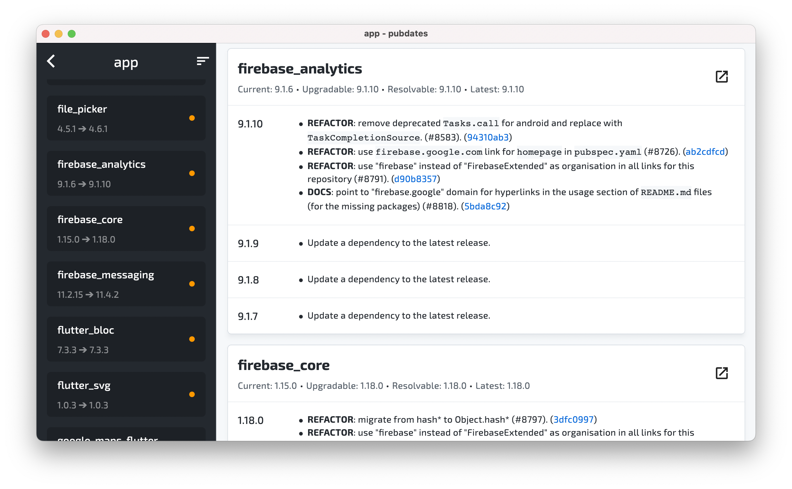
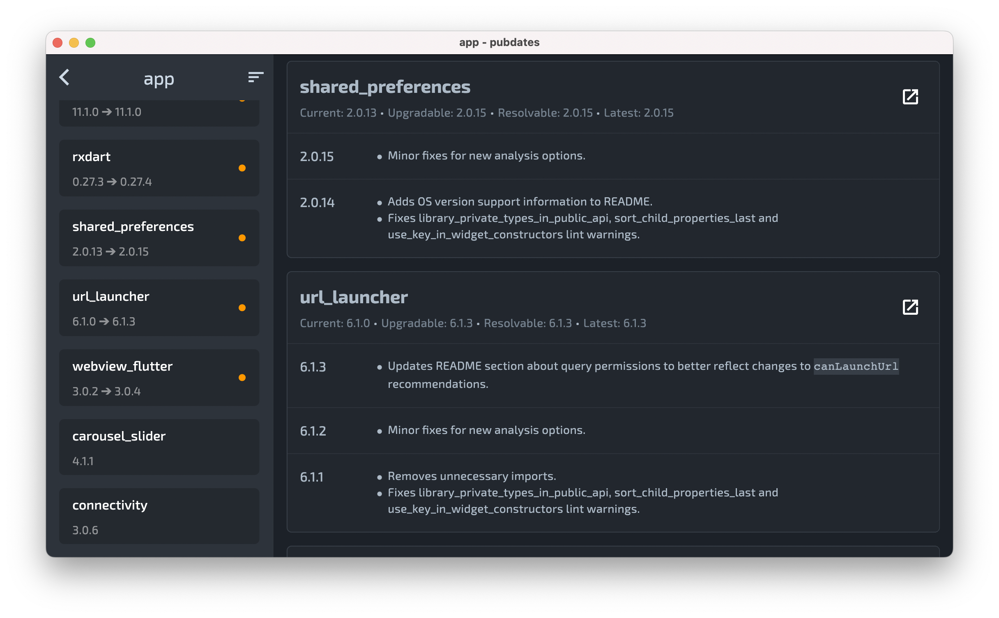

<!-- TODO: put logo here -->
**pubdates** (pub.dev + updates 😎) is a cross-platform desktop app for viewing changelogs of outdated packages in Dart projects. The app is **WIP**, so don't expect things working as described.
<br>

<!-- TODO: put some fancy badges to be hip -->

**Why does it even exist?**  
Checking or upgrading the dependencies of a Dart or Flutter project can be quite tiresome. For those who don't know, one has to perform the following steps:

1. `cd` into the project directory
2. Run `dart pub outdated` or `flutter packages outdated`
3. Drink two cups of coffee till the command finishes
4. For each package that can be upgraded, head to its [pub.dev](https://pub.dev) page and check the changelog (and being good developers, we always read changelogs, don't we?)

This is tolerable if you have one or two active projects, but, if you have more than two (let me hug you, my unlucky friend), there is a chance that you'll get a caffeine overdose and die. And thus this app was born. What it does is automates the described process (sans the coffee drinking step of course), to have all the changelogs of outdated dependencies used in the project parsed and listed in one place.

(Actually, scratch that. I simply wanted to build a desktop app in Flutter but had no idea what to build.)


## Screenshots

(Had to rent a Mac to take these boring screenshots cause Flutter apps on Windows look [💩^Htoo beautiful to be posted for free](https://github.com/flutter/flutter/issues/53308))






## Installation
[TODO]

### Running
For running the app, one of the following commands will do:

```shell
make run-linux
```

```shell
make run-macos
```

```shell
make run-windows
```


## Notes
- The app, unfortunately, relies on the output of the `pub outdated` command and therefore requires Dart or Flutter to be installed on the system it is run on.
- The app won't work for projects that don't have the `pubspec.lock` file.
- The app may fail to parse some changelogs but [I'm working on it](https://memegenerator.net/img/instances/61567163.jpg).
- The app works only for direct dependencies and dev-dependencies hosted on [pub.dev](https://pub.dev), everything else is skipped.